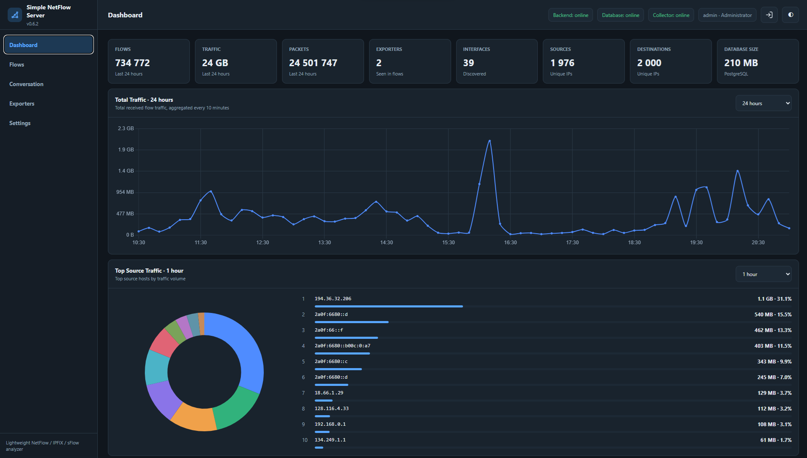
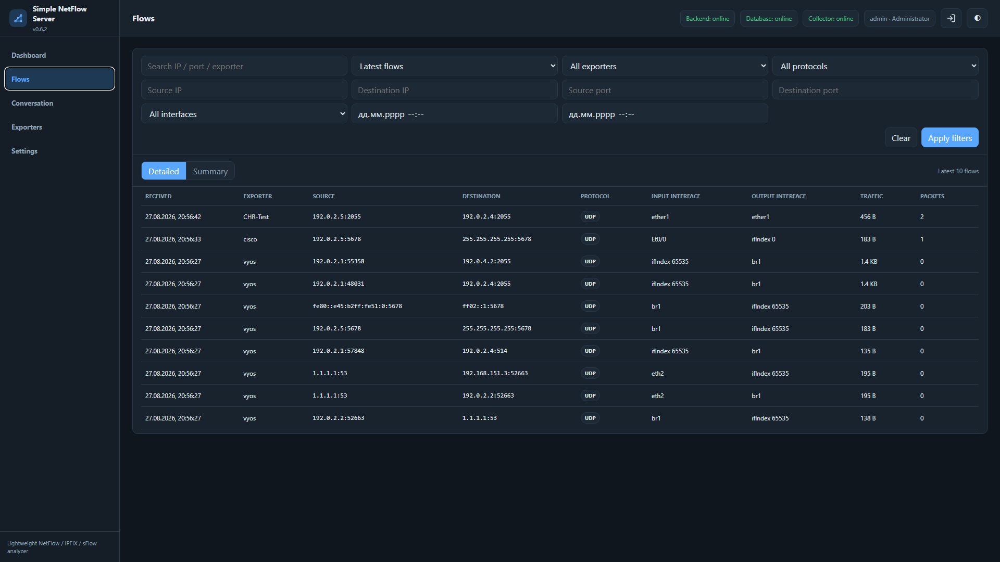
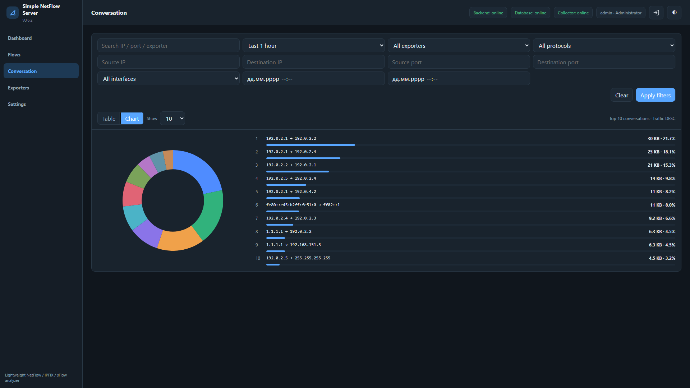
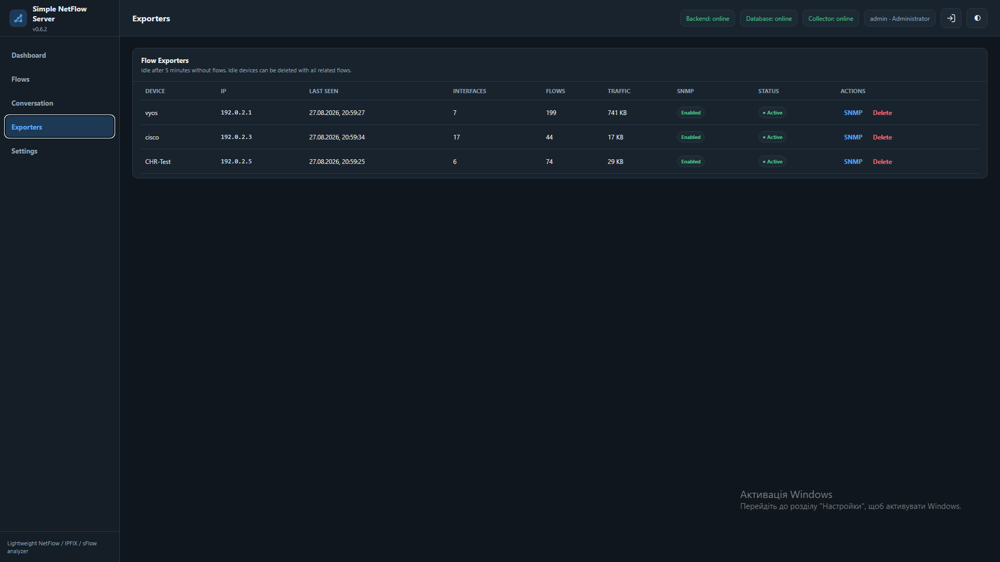
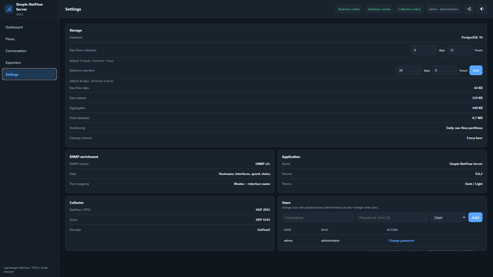

```{=html}
<p align="center">
```
``{=html}
```{=html}
</p>
```
```{=html}
<h1 align="center">
```
Simple NetFlow Server
```{=html}
</h1>
```
```{=html}
<p align="center">
```
`<strong>`{=html}A lightweight NetFlow collector and traffic analyzer
with a modern web interface.`</strong>`{=html}
```{=html}
</p>
```
```{=html}
<p align="center">
```
Monitor network traffic, analyze flows, discover top talkers, inspect
conversations, and track exporters from a simple Docker-based
application.
```{=html}
</p>
```
```{=html}
<p align="center">
```
`<a href="https://github.com/RyVolodya/simple-netflow-server">`{=html}GitHub
Repository`</a>`{=html}
```{=html}
</p>
```

------------------------------------------------------------------------

## About

**Simple NetFlow Server** is a lightweight network traffic monitoring
and analysis platform for collecting and analyzing flow data from
routers, switches, firewalls, and other network devices.

It provides a clean web interface for traffic analysis without the
complexity of large monitoring platforms. It is designed for home labs,
small and medium networks, and network engineers who need a practical
NetFlow analyzer.

The application runs in Docker and combines a flow collector, FastAPI
backend, PostgreSQL database, and web frontend.

Starting with the v0.8.x storage model, recent traffic is kept as
**Detailed Conversations**, while older traffic can be retained as
compact **5-minute historical statistics**. This provides detailed
short-term troubleshooting together with storage-efficient long-term
analysis.

**Current version:** `v0.8.7`

**Project repository:**
https://github.com/RyVolodya/simple-netflow-server

## Features

### Dashboard

-   Total Traffic and Total Flows
-   Exporters and Interfaces
-   Database Size
-   Collector / Backend / Database status
-   Top Source Traffic
-   Top Destination Traffic
-   Top Devices
-   Top Applications
-   Top Interfaces
-   Traffic history
-   Configurable analysis periods
-   Drill-down from charts into filtered flow data
-   Cached dashboard summaries to reduce repeated database load

### Flows

Advanced filtering by time period, custom From/To range, Exporter,
Interface, Source/Destination IP, Protocol and Source/Destination port.

Two modes are available:

-   **Detailed** --- recent service-oriented conversation records with
    timestamps, exporter, source/destination, protocol, service,
    interfaces, traffic, packets and represented flow count.
-   **Summary** --- aggregated traffic for the current filters.

Time presets automatically follow the configured **Detailed
Conversations retention**.

`Custom period` automatically selects the storage layer:

-   If **both From and To are inside the Detailed retention window**,
    detailed data is displayed.
-   If **either From or To is outside the Detailed retention window**,
    compact **5-minute Statistics** are displayed.

Pagination (10 / 25 / 50 / 100), sorting and filtered analysis are
supported.

### Conversations

The **Conversations** page shows communication between hosts, aggregated
as:

``` text
Source IP → Destination IP
```

Each conversation includes Source IP, Destination IP, Total Traffic,
Packets and Flow count. Results are ordered from highest traffic to
lowest.

Conversation analysis can also use **Input Interface → Output
Interface** grouping.

Available views:

-   Table
-   Chart
-   Top 10 / 25 / 50 / 100

The same Smart Custom Period logic used by Flows applies here: recent
custom ranges use Detailed data, while ranges crossing the Detailed
retention boundary use 5-minute historical Statistics.

### Exporters

-   Automatic exporter discovery
-   Active / Idle status
-   Last flow received
-   SNMP configuration
-   Device hostname discovery
-   Interface discovery
-   Delete exporter and associated traffic data

### SNMP Enrichment

SNMP enrichment can retrieve device hostnames, interface names and
interface indexes, allowing readable interface names such as `ether1`,
`VLAN100` or `GigabitEthernet0/1` instead of only numeric ifIndex
values.

### Storage & Retention

Storage is divided into two levels.

**Detailed Conversations**

Recent service-oriented conversation data can be retained for:

``` text
1 / 3 / 6 / 12 / 24 hours
```

**Statistics**

Historical statistics are configured in **days**:

``` text
Minimum:     1 day
Recommended: up to 30 days
```

Longer retention is supported but requires additional PostgreSQL
storage.

Historical Source → Destination conversations use a fixed **5-minute
resolution** and preserve exporter, source/destination IP, protocol,
service, input/output interfaces, traffic, packets and flow count.

Ephemeral client ports and unnecessary per-flow metadata are not
retained in historical conversations, reducing database growth.

#### Smart Custom Period

If both `From` and `To` are inside the current Detailed Conversations
retention window, Flows and Conversation use **Detailed data**.

If either boundary is outside that window, they automatically use
**5-minute Statistics**.

Example with 6-hour Detailed retention:

``` text
Detailed window: 12:00 → 18:00

13:00 → 17:30 = Detailed
11:00 → 17:30 = 5-minute Statistics
13:00 → 18:30 = 5-minute Statistics
10:00 → 11:00 = 5-minute Statistics
```

Available preset periods also adapt to Detailed retention. For example,
6-hour retention provides `1h / 3h / 6h / Custom period`.

### User Management

**Administrator:** full access, exporter/SNMP management, retention and
application settings, users and passwords.

**User:** view dashboards, analyze flows/conversations, and change own
password.

### Responsive UI Improvements

Flows and Conversation filters have been improved for both desktop and
mobile use:

-   Mobile filters stay within the screen width without horizontal
    overflow
-   Mobile `From / To` controls include a date/time format hint
-   Desktop `From / To` fields match the width of other filter controls
-   Duplicate desktop datetime hints were removed

### Application Status & Version

Application and Backend version checks are synchronized in **v0.8.7**.
This fixes the Backend status indicator incorrectly appearing as a
warning when the backend is running the current application version.

------------------------------------------------------------------------

## Screenshots

> Store screenshots in `/docs/images/`.

### Dashboard



### Flows



### Conversations



### Exporters



### Settings



------------------------------------------------------------------------

## Architecture

``` text
Router / Switch
      │
      │ NetFlow / IPFIX
      ▼
┌───────────────┐
│ Flow Collector│
└───────┬───────┘
        ▼
┌───────────────┐
│    Backend    │
│    FastAPI    │
└───────┬───────┘
        ▼
┌───────────────┐
│  PostgreSQL   │
│ Raw + Stats   │
└───────┬───────┘
        ▼
┌───────────────┐
│ Web Frontend  │
└───────────────┘
```

Main Docker services: `frontend`, `backend`, `collector`, `postgres`,
and `spool-guard`.

All services use the shared Docker network `simple-netflow`.

The collector writes through a persistent JSONL spool. Crash-safe
rotation and the `spool-guard` service protect the spool from
uncontrolled growth. Default protection limits are 512 MB hard limit,
384 MB resume threshold and 128 MiB rotation size.

## Installation

### Requirements

-   Linux server
-   Docker
-   Docker Compose plugin

Clone the official repository:

``` bash
git clone https://github.com/RyVolodya/simple-netflow-server.git
cd simple-netflow-server
```

Start the application:

``` bash
docker compose up -d --build
```

Check status:

``` bash
docker compose ps
```

## Web Interface

Default:

``` text
http://SERVER-IP:8080
```

Optional `.env` setting:

``` env
FRONTEND_PORT=3080
```

Restart after changing it:

``` bash
docker compose down
docker compose up -d
```

## Default Login

``` text
Username: admin
Password: netflow
```

> \[!IMPORTANT\] Change the default administrator password after the
> first login and before production use.

## NetFlow Collector

Configure devices to send flow data to:

``` text
Collector IP: SERVER-IP
Collector Port: 2055/UDP
```

UFW example:

``` bash
sudo ufw allow 2055/udp
```

## MikroTik Example

``` routeros
/ip traffic-flow
set enabled=yes

/ip traffic-flow target
add dst-address=SERVER-IP port=2055 version=9
```

Verify:

``` routeros
/ip traffic-flow print
/ip traffic-flow target print
```

## Cisco IOS Example

``` cisco
ip flow-export destination SERVER-IP 2055
ip flow-export version 9
ip flow-export source GigabitEthernet0/0

interface GigabitEthernet0/0
 ip flow ingress
 ip flow egress
```

Verify:

``` cisco
show ip flow export
show ip cache flow
```

## Database Design

``` text
Incoming Flow
     │
     ├──── Detailed Conversations
     │        ├── Service-oriented aggregation
     │        └── 1 / 3 / 6 / 12 / 24 hour retention
     │
     └──── Historical Statistics
              ├── 5-minute Source → Destination buckets
              ├── Compact service-oriented dimensions
              └── Retention configured in days
```

Historical statistics intentionally omit ephemeral client ports to
reduce storage requirements while preserving useful traffic-analysis
dimensions.

## Updating

``` bash
git pull
docker compose down --remove-orphans
docker compose up -d --build --remove-orphans
```

Upgrading to **v0.8.7** does **not** require deleting the PostgreSQL
database or Docker volumes.

The historical statistics structures are initialized automatically.
Historical Source → Destination data that was already deleted by an
older retention policy cannot be reconstructed.

## Logs

``` bash
docker compose logs -f
docker compose logs -f backend
docker compose logs -f collector
docker compose logs -f postgres
```

## Project Goals

-   Simple deployment
-   Low resource usage
-   Clean and responsive GUI
-   Useful traffic visualization
-   Fast troubleshooting
-   Short-term detailed conversation analysis
-   Storage-efficient long-term statistics
-   Historical Source → Destination analysis
-   Easy Docker deployment

The goal is to provide a lightweight and practical NetFlow analyzer for
everyday network engineering tasks.

## Roadmap

-   Extended IPFIX support
-   IPv6 analysis improvements
-   DNS / reverse DNS enrichment
-   ASN and GeoIP enrichment
-   More conversation analytics
-   Report export
-   Additional SNMP information
-   Notifications and alerts

## Contributing

Contributions, bug reports and feature requests are welcome.

Please use the repository issue tracker:

https://github.com/RyVolodya/simple-netflow-server/issues

When reporting an issue, include:

-   Simple NetFlow Server version
-   Docker version
-   Device/vendor
-   NetFlow/IPFIX version
-   Relevant logs
-   Steps to reproduce

## License

See the `LICENSE` file for license information.

## Author

Created and maintained by **RyVolodya**.

Project: https://github.com/RyVolodya/simple-netflow-server

If you find this project useful, consider giving the repository a ⭐.
